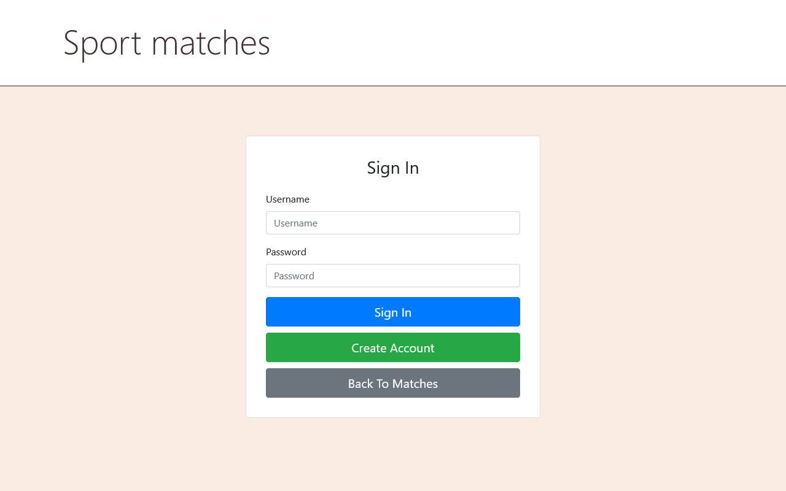
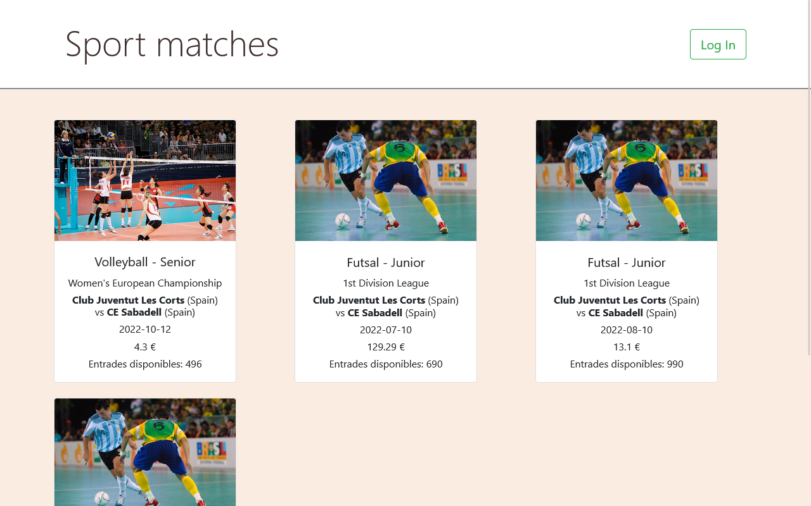
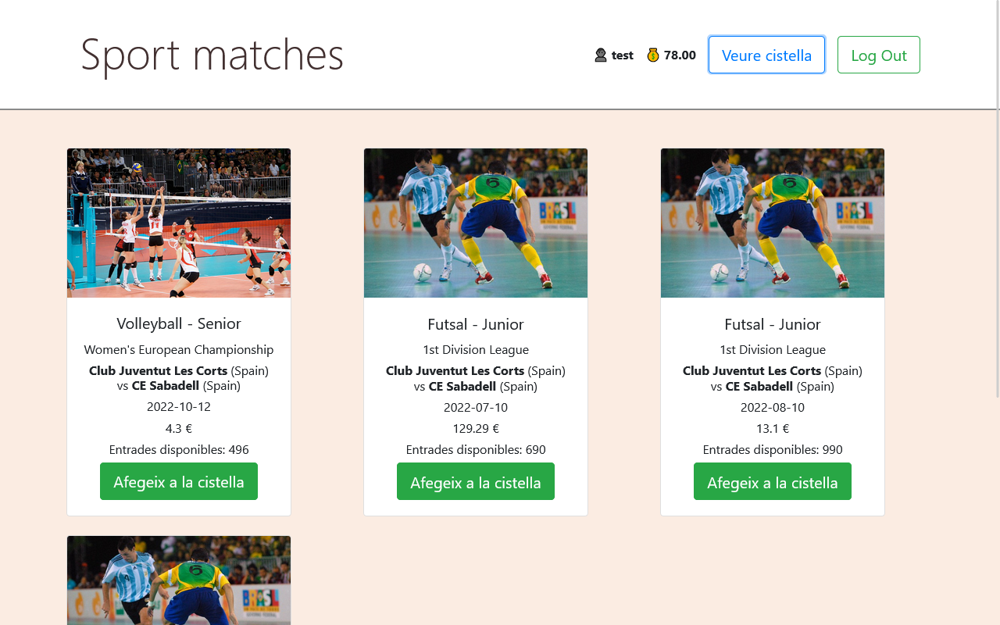
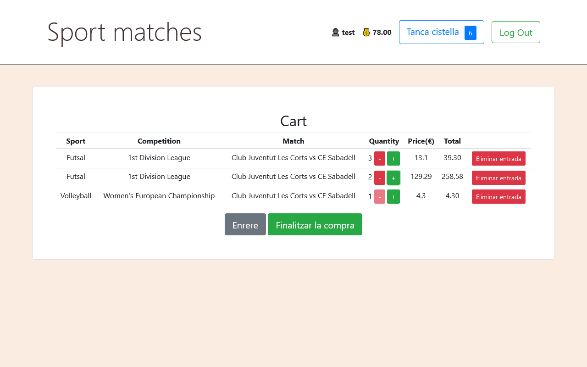

# Enunciat Pràctica 2

Introducció
============

En aquesta pràctica farem una pàgina web capaç de mostrar 
informació sobre esdeveniments esportius i reservar-ne les entrades.
Però primer de tot desenvoluparem una REST-API capaç de proporcionar-nos la informació necessària. També desenvoluparan les funcions relacionades amb la gestió d'aquestes dades com
afegir, eliminar o modificar les dades emmagatzemades.

Amb aquest propòsit utilitzarem el Framework anomenat FastAPI.

Important
---------

Aquest exercici guiat suposa que ja teniu alguna versió de Python de versió mínima 3.10
instal·lada i esteu familiaritzats amb la instal·lació de paquets mitjançant pip.

Tingueu en compte que el pip command mostrat en aquest tutorial correspondrà a pip3 
segons quantes versions diferents de python tingueu
instal·lat al vostre ordinador.

Es recomana altament l'ús de la IDE [PyCharm Professional](https://www.jetbrains.com/pycharm/) per al desenvolupament d'aquesta pràctica. Si no el teniu instal·lat, existeix una versiñó per a estudiants que podeu obtenir si us enregistreu amb el correu de la UB. 

Enviament dels Exercicis
------------------------
Es treballarà de la mateixa manera que a la Pràctica 1. 

- Els exercicis i deures s'enviaran com a Pull Requests al repositori del Github Classroom. 
- Si n'hi ha, les respostes a les preguntes 
s'enviaran com a commentaris en el Pull Requests. 
- S'ha de fer Peer Review dels Pull Requests per part de l'altre membre del grup.
- Durant la realització de la pràctica haureu d'anar documentant el vostre progrés en la memòria que trobareu en el directori `docs` del template de la pràctica.  

Avaluació pràctica 2.
---------------------------
- 30% Fer els pull requests setmanalment.
- 70% Lliurament final: 20% Sessió de Test, 50% codi final, 30% Memòria progrès.

Objectius de la Pràctica
-------------------

#### Back-End: 
* Crear aplicació CRUD amb autentificació per a gestionar (CRUD: Create, Read, Update i Delete) de la part de model d'aplicació 

#### Front-End: 
L'aspecte de l'aplicació ha de ser semblant en aquest:

- **Vista LOG IN**

- **Vista Matches sense usuari Loggat**

- **Vista Matches amb l'usuari loggat**

- **Vista de la Cistella de la Compra**

Calendari
==========

|  Sessió  |  Data | Tema  |  Guia | Enllaços |
|---|---|---|---|----------|
| 1 | 17/04/24 |  Backend i Deplegament| Creació Models i Endpoints | [Enunciat](./Sessio_1.md) / [Resum](./slides/SD2024_P2_Sessio1.pdf)
| 2 | 24/04/24 | Frontend  | Creació del Frontend  | [Enunciat](./Sessio_2.md) / [Resum](./slides/SD2024_P2_Sessio2.pdf)
| 3 | 08/05/24  | Seguretat |  Autenticació i protecció d'endpoints| 
| 4 | 22/05/24  |  Depuració, Testing i Performance per a múltiples usuaris | Testing i Depuració   | 
| 5  | 29/05/24  | Sessió de Testing | Guia Sessió de testing |

