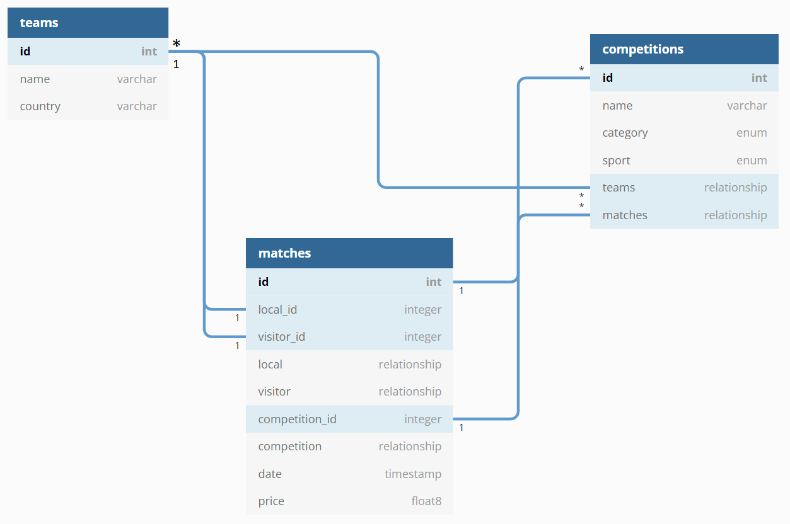

# Sessió 1
En aquesta sessió començarem la pràctica 2. Clonarem el projecte base amb què treballarem, i n'explorarem les seves
principals components, veient com desplegar-lo tant en local per a desenvolupament, com al núvol per producció. Us proposem
un conjunt d'exercicis per facilitar-vos la realització de la pràctica.

## Objectius
* Entendre el problema a resoldre durant la pràctica 2
* Conèixer les tecnologies que s'utilitzaran durant la pràctica
* Tenir un entorn de desenvolupament funcional
* Desenvolupar el backend
  * Afegir nous models
  * Generar les migracions dels models a la base de dades
  * Crear els endpoints per gestionar les operacions CRUD a l'API

## Guies
Per realitzar els exercicis d'aquesta sessió, teniu disponibles les guies següents:
* [Introducció FastAPI](guies/intro_FastAPI.md)
* [Introducció Base de Dades](guies/intro_db.md)

## Exercicis al laboratori

### Exercici 1: Preparació de l'entorn

Clona el repositori de GitHub Classrooms per al teu grup i segueix les instruccions del **Readme.md** fins al punt 1.1.4.


### Exercici 2: Creació del model Teams 

Seguint el diagrama de l'aplicació següent:



Primer de tot definirem el model per guardar els equips (Teams). Per fer-ho, crea un nou fitxer ```team.py``` dins el 
directori ```app/models``` del backend. Seguint l'exemple que teniu per als usuaris en el fitxer ```user.py``` d'aquest directori,
posa el següent contingut:

```python
""" Teams models """
from sqlmodel import Field
from .base import SQLModel

# Shared properties
class TeamBase(SQLModel):
    name: str
    country: str
    description: str | None = None
    
# Database model, database table inferred from class name
class Team(TeamBase, table=True):
    id: int | None = Field(default=None, primary_key=True)
```

Fixeu-vos que estem combinant la definició Pydantic del model amb la definició explicita de la taula que es crearà a la
base de dades. A banda dels camps del diagrama, hem afegit un camp opcional "description". Ara caldrà que aquest nou model sigui visible dins els models de l'aplicació. Per fer-ho, modificarem el 
fitxer ```__init__.py``` d'aquest directori, perquè quedi de la següent manera:

```python
""" Models package """
# Import all models
from .base import SQLModel
from .user import *
from .team import *
```

### Exercici 3: Creació de la taula Team a la base de dades 

El següent pas és crear una nova migració per incorporar aquest model a la base de dades. Utilitzarem l'eina **alembic** per
generar una migració automàtica:

```bash
alembic revision --autogenerate -m "Added Team table"
```

Si tot ha anat bé, s'haurà creat un nou fitxer dins de la carpeta ```backend/alembic``` amb un contingut similar al següent:
```python
...

def upgrade():
    # ### commands auto generated by Alembic - please adjust! ###
    op.create_table('team',
    sa.Column('name', sqlmodel.sql.sqltypes.AutoString(), nullable=False),
    sa.Column('country', sqlmodel.sql.sqltypes.AutoString(), nullable=False),
    sa.Column('description', sqlmodel.sql.sqltypes.AutoString(), nullable=True),
    sa.Column('id', sa.Integer(), nullable=False),
    sa.PrimaryKeyConstraint('id')
    )
    # ### end Alembic commands ###


def downgrade():
    # ### commands auto generated by Alembic - please adjust! ###
    op.drop_table('team')
    # ### end Alembic commands ###
```

Fixeu-vos que la migració defineix dos mètodes:
* **upgrade:** Modificar la base de dades afegint una nova taula team
* **downgrade:** Desfer aquests canvis, eliminant la taula team


### Exercici 4: Creació endpoints de manipulació 

Segueix les indicacions de la guia [Introducció FastAPI](guies/intro_FastAPI.md), adaptant-les a l'estructura del projecte actual.
Comprova que pots afegir, llistar i eliminar equips a través de la documentació interactiva de l'API. En concret:

1. Adapteu el mètode `@app.get("/team/{team_name}")` per a que funcioni amb el model anterior.

2. Escriviu el mètode DELETE que elimini un equip de la llista d'equips. Torneu un missatge indicant si aquest equip s'ha suprimit o no i el codi corresponent.

3. Escriviu el mètode PUT que, si no existeix aquest equip, crea un equip nou i l'afegeix a la llista d'equips. En cas contrari, modifica els valors de l'equip amb aquest identificador amb la informació del cos de la sol·licitud del PUT (aquesta informació pot ser completa o parcial!). Retorna l'equip creat o modificat.


## Tasques fora del laboratori

1.  Escriviu els mètodes GET, POST, DELETE i PUT per a un model anomenat Competition amb la URL:

        '/competitions/
    A sota teniu exemples de competicions, definiu el model Pydantic segons els exemples.

2.  Escriviu els mètodes GET, POST, DELETE i PUT per a un model anomenat Match amb la URL:

        '/matches/'

    A sota teniu exemples de competicions, definiu el model Pydantic segons els exemples.

3. Feu els mètodes GET per a competicions i matches donat l'ID. 
    
4. Proveu i comproveu tots els mètodes desenvolupats amb `requests` o una altra eina de prova d'APIs.

5. Feu un test per a cada mètode desenvolupat i proveu que tot funciona correctament.

**Dades d'exemple**

``` python
competitions = [
    {'id': 0,
    'name': "Women's European Championship",
    'category': 'Senior',
    'sport': 'Volleyball',
    'teams': []},
    {'id': 1,
    'name': "1st Division League",
    'category': 'Junior',
    'sport': 'Football',
    'teams': []},
    {'id': 2,
    'name': "Women's Copa Catalunya",
    'category': 'Senior',
    'sport': 'Basketball',
    'teams': []},
    {'id': 3,
    'name': "1st Division League",
    'category': 'Junior',
    'sport': 'Futsal',
    'teams': []}
]

teams = [
    {'name': "CV Vall D'Hebron",
     'country': 'Spain'},
    {'name': 'CE Sabadell',
     'country': 'Spain'},
    {'name': 'Club Juventut Les Corts',
     'country': 'Spain'},
    {'name': 'Volei Rubi',
     'country': 'Spain'}
]

matches = [
    {'id': 0,
     'local': "CV Vall D'Hebron",
     'visitor': 'Volei Rubi',
     'date': '2022-07-03',
     'price': 15.20}
]
``` 
