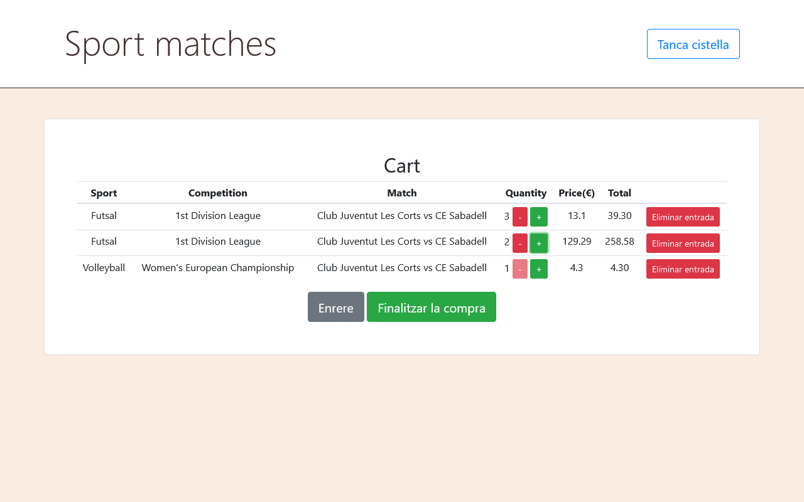

# Sessió 2

En aquesta sessió començarem el frontend de la pràctica 2. A partir del projecte clonat a la sessió 1,Clonarem el projecte base amb què treballarem, i n'explorarem les seves
principals components, veient com desplegar-lo tant en local per a desenvolupament, com al núvol per producció. Us proposem
un conjunt d'exercicis per facilitar-vos la realització de la pràctica.

## Objectius
* Entendre el problema a resoldre durant la pràctica 2
* Conèixer les tecnologies que s'utilitzaran durant la pràctica
* Tenir un entorn de desenvolupament funcional
* Desenvolupar el frontend
  * Instal·lació eines
  * Creació del projecte
  * Connectar el frontend amb l'API
* Desplegar al núvol

## Guies
Per realitzar els exercicis d'aquesta sessió, teniu disponibles les guies següents:
* [Introducció a Vue](guies/intro_vue.md)
* [Connectar Vue amb l'API](guies/vue_api.md)
* [Col·leccions amb Vue](guies/vue_collection.md)

## Exercicis al laboratori

### Exercici 1: Preparació del frontend

A partir del projecte clonat a la sessió 1, segueix les instruccions del **Readme.md** per al punt 1.2.

### Exercici 2: Creació component Team

Segueix les instruccions de la [guia d'introducció a Vue](guies/intro_vue.md) per instal·lar Bootstrap en el projecte.

### Exercici 3: Creació dels components Team i TeamSet

Crea un nou fitxer ```frontend/src/component/Team.vue```, que contindrà la definició d'un nou component per visualitzar
la informació d'un equip:

```js
<template>
  <div class="card">
    <h5 class="card-header">{{ name }}</h5>
    <div class="card-body">
      <h5 class="card-title">Informació</h5>
      <p class="card-text"><strong>ID:</strong> {{id}}</p>
      <p class="card-text"><strong>name:</strong> {{name}}</p>
      <p class="card-text"><strong>country:</strong> {{country}}</p>
    </div>
    <div v-if="description" class="card-footer">{{description}}</div>
  </div>
</template>

<script>
export default {
  name: 'Team',
  props: ['id', 'name', 'country', 'description']
}
</script>
```

Fixa't que estem definint un conjunt de propietats que esperem que siguin inicialitzades d'alguna forma. Ara crea un nou
fitxer ```frontend/src/component/TeamSet.vue```, que contindrà la definició d'un nou component per visualitzar
la informació d'un conjunt equips:

```js
<template>
  <div class="card-deck">
    <team v-for="(team) in data" :key="team.id" v-bind="team"></team>
  </div>
</template>

<script>
import Team from './Team.vue'

export default {
  name: 'TeamSet',
  components: { 'team': Team },
  data () {
    return {
      data: [],
      count: 0
    }
  },
  mounted () {    
    this.count = 2
    this.data = [
      {
        id: 1,
        name: 'test team 1',
        country: 'test team 1 country',
        description: 'an optional description for test team 1'
      },
      {
        id: 2,
        name: 'test team 2',
        country: 'test team 2 country',
        description: null
      }
    ]
  }
}
</script>
```
En aquest cas, el conjunt d'equips es basa en la definició d'equip anterior. Fixeu-vos en l'ús dels modificadors de Vue
**v-if**, **v-for** i **v-bind** en les plantilles dels components.


### Exercici 4: Afegir la visualització dels equips al enrutador

Modifica el fitxer d'enrutament ```frontend/src/router/index.js```, per tal que es mostri el component de l'exercici anterior
en el path ```/teams```:
```js
import Vue from 'vue'
import Router from 'vue-router'
import HelloWorld from '@/components/HelloWorld'
import TeamSet from '@/components/TeamSet'

Vue.use(Router)

export default new Router({
  routes: [
    {
      path: '/',
      name: 'HelloWorld',
      component: HelloWorld
    },
    {
      path: '/teams',
      name: 'TeamSet',
      component: TeamSet
    }
  ]
})
```

podeu comprovar que funciona el nou camí navegant a <http://localhost:8080/#/teams>. Haurieu de visualitzar una targeta
bootstrap com la següent:


### Exercici 5: Creació servei gestió d'equips

Si us fixeu en el codi del component ```TeamSet```, l'obtenció de la informació la tenim integrada en el mateix component.
Ara el què farem és definir un nou element anomenat **servei**, que ens permeti gestionar tota la informació relacionada
amb els equips.

Crea un fitxer ```frontend/src/services/TeamService.js``` amb el següent contingut:
```js
class TeamService {
  getAll () {
    return {
      count: 2,
      data: [
        {
          id: 1,
          name: 'test team 1',
          country: 'test team 1 country',
          description: 'an optional description for test team 1'
        },
        {
          id: 2,
          name: 'test team 2',
          country: 'test team 2 country',
          description: null
        }
      ]
    }
  }
}

export default new TeamService()
```
Modifica el component ```TeamSet``` per a que utilitzi aquest servei:

```js
<template>
  <div class="card-deck">
    <team v-for="(team) in data" :key="team.id" v-bind="team"></team>
  </div>
</template>

<script>
import Team from './Team.vue'
import TeamService from '../services/TeamService'

export default {
  name: 'TeamSet',
  components: { 'team': Team },
  data () {
    return {
      data: [],
      count: 0
    }
  },
  mounted () {
    TeamService.getAll().then(response => {
      this.data = response.data
      this.count = response.count
    })
  }
}
</script>
```

### Exercici 6: Accés a l'API

Fins ara hem estat agafant les dades des d'una estructura ja definida. Ara el què farem serà accedir directament a la 
informació guardada a la base de dades gestionada pel backend. Per fer-ho, modificarem el servei perquè utilitzi l'API.
L'alternativa més habitual és utilitzar la llibreria **axios**. Primer instal·lem la nova dependència, executant dins
el directori **frontend** la següent comanda:

```bash
npm install --save axios 
```

**Nota Important:** Hi ha un problema amb la versió actual d'axios, per tant, si en fer els canvis següents et dona un
error del tipus:

```
ERROR in ./node_modules/axios/lib/platform/index.js
Module parse failed: Unexpected token (5:2)
You may need an appropriate loader to handle this file type.
|
| export default {
| ...utils,
| ...platform
| }
@ ./node_modules/axios/lib/defaults/index.js 8:0-44
@ ./node_modules/axios/lib/axios.js
@ ./node_modules/axios/index.js
@ ./src/utils/request.js
@ ./src/main.js

Build failed with errors.
```

instal·la la versió antiga amb les següents comandes:

```bash
npm uninstall axios
npm install --save axios@0.25.0
```

Ara modifiquem el servei perquè demani la lista d'equips a l'API:

```js
import axios from 'axios'

class TeamService {
  getAll () {
    return axios.get('http://localhost:8000/api/v1/teams/')
      .then((res) => {
        return res.data
      })
  }
}

export default new TeamService()
```

Caldrà activar la configuració de CORS, afegint en el fitxer ```.env``` la variable ```BACKEND_CORS_ORIGINS```,
com es mostra a continuació:
```bash
...
BACKEND_CORS_ORIGINS=http://localhost:8080
```

Si us fixeu en el mètode **getAll**, veureu que s'utilitza tot l'URL d'accés a l'endpoint. A banda de que és una informació
repetitiva que no aporta res al mètode, això suposa un problema, ja que quan estiguem en desenvolupament ens interessarà 
apuntar en l'entorn de desenvolupament, però quan estiguem a producció voldrem apuntar l'API de producció. Per facilitar 
aquesta transició, separarem el que és la declaració de l'endpoint del servidor que hostatja l'API.

Crea un fitxer ```frontend/src/http-common.js``` amb el següent contingut:
```js
import axios from 'axios'

export default axios.create({
  baseURL: 'http://localhost:8000',
  headers: {
    'Content-type': 'application/json'
  }
})
```
i actualitza el servei anterior perquè utilitzi aquest client:
```js
import http from '../http-common'

class TeamService {
  getAll () {
    return http.get('/api/v1/teams/')
      .then((res) => {
        return res.data
      })
  }
}

export default new TeamService()
```

### Exercici 7: Configuració per entorn

Per configurar el frontend, tenim els fitxers dins la carpeta ```config```. Caldrà definir les variables en els diferents
entorns on siguin necessàries. 

Un cop definides, podem accedir a les variables des del codi utilitzant ```process.env.NOM_VAR```. Per exemple, per tal 
que el frontend apunti a l'API correcta, modificarem l'URL definida en l'exerici anterior de la següent manera:

```js
import axios from 'axios'

export default axios.create({
  baseURL: process.env.API_URL,
  headers: {
    'Content-type': 'application/json'
  }
})
```
i afegirem la variable ```API_URL``` als dos fitxers de configuració:

**prod.env.js**
```js
'use strict'
module.exports = {
  NODE_ENV: '"production"',
  API_URL: '"https://ub_sd_p2_2024_[GXX]_API.onrender.com"'
}
```
**dev.env.js**
```js
'use strict'
const merge = require('webpack-merge')
const prodEnv = require('./prod.env')

module.exports = merge(prodEnv, {
  NODE_ENV: '"development"',
  API_URL: '"http://localhost:8000"'
})
```

Arribats a aquest punt, ja tenim tots els elements bàsics de la pràctica, i les configuracions necessàries tant al backend 
com al frontend. A mode resum:

- **backend:** En l'entorn de desenvolupament utilizem el fitxer ```.env``` per definir totes les variables de configuració. 
Quan despleguem al núvol (amb Docker dins de Render.com) utilitzarem les variables d'entorn. Idealment també caldria utilitzar
secrets encriptats per a les contrasenyes, però de cara a aquesta pràctica no ho farem.
- **frontend:** Del frontend només ens cal configurar l'URL on hi ha l'API. Per fer-ho, hem definit una variable d'entorn 
en els fitxers de la carpeta ```config```, ```dev.env.js``` per a desenvolupament i ```prod.env.js``` per a producció.

### Exercici 8: Comandes

A la primera sessió es va treballar amb el model de l'usuari (User), que guardava la informació genèrica d'un usuari, 
com ara el correu, el nom d'usuari, el nom real o la contrasenya. Ara volem associar a cada usuari un compte amb la
informació pròpia de l'aplicació (Account) i poder assignar a aquests comptes les comandes (Order) que faci a la botiga. 
Crea un nou fitxer ```backend/app/models/order.py``` amb els següents models (**adapta'ls** als noms i models de la teva pràctica):

```python
...

""" User accounts model class """
class Account(SQLModel, table=True):
    id: int = Field(default=None, primary_key=True, foreign_key="user.id")
    available_money: float
    orders: list["Order"] = Relationship(back_populates="account")

""" Orders model class """
class Order(SQLModel, table=True):
    id: int = Field(default=None, primary_key=True)
    match: Match = Relationship(back_populates="orders")
    tickets_bought: int
    account: Account = Relationship(back_populates="orders")
```

Actualitza el packet de models per a reflectir els canvis. Finalment, afegiu un camp nou `total_available_tickets` al model de Match que per defecte sigui el nombre de localitats 
del lloc on s'està fent (valor enter). Executa les migracions necessaries a la base de dades.


## Tasques fora del laboratori

### Tasca 1: Gestió comandes 

Creeu aquests punts finals (endpoints) a `main.py`, així com els schemas corresponents al packet `app.models`:

- POST: crea un nou compte d'usuari.
- GET: retorna totes les comandes per nom d'usuari.
- POST: afegeix una nova comanda per nom d'usuari.
- GET: retorna totes les comandes.

```python
@app.post('/account', response_model=app.models.Account)
@app.get('/orders/{username}', response_model=app.models.Order)
@app.post('/orders/{username}', response_model=app.models.Order)
@app.get('/orders', response_model=list[app.models.Order])')
```

A `repository` feu els següents passos per a la lògica de negoci d'afegir una nova comanda:

       1. Comproveu si l'usuari té prou diners per comprar el bitllet

       2. Comproveu si hi ha entrades disponibles

       3. Actualitzeu les entrades disponibles a Match (- entrades comprades)

       4. Actualitzeu els diners de l'usuari després de comprar els bitllets (-preu * bitllets comprat)

       5. Afegiu la comanda a la relació d'usuari `user.orders.append(new_order)`

       6. Deseu els canvis fets a  comanda, match i l'usuari a la BD. **Atenció!** amb les condicions de carrera!. Feu un sol commit per a totes les operacions i comproveu si es provoca algun error, en aquest cas caldrà fer un rollback i tornar-ho a intentar o retornar un error.


### Tasca 2: Vista taula de la cistella




Ara ja podem tornar a editar el nostre frontend. Fem la taula on l'usuari pot visualitzar la seva comanda i la seva informació. En aquesta taula, podem veure:

1. **Esport**

1. **Competició**

1. **Partit** (Club Juventut Les Corts vs CE Sabadell)

1. **Quantitat**: quantitat d'entrades comprades per a aquest espectacle. L'usuari pot interactuar afegint o restant un bitllet amb dos botons.

1. **Preu**: preu per bitllet

1. **Total**: suma del preu de totes les entrades

1. **Eliminar entrada**: botó per esborrar un partit de la cistella

Per crear aquesta taula, podeu utilitzar l'estructura clàssica
(<https://www.w3schools.com/html/html_tables.asp>). `<thead>` conté les capçaleres:

```html
<table>
  <thead>
  <tr>
    <th>Sport</th>
    <th>Competition</th>
    <th>Match</th>
    <th>Quantity</th>
    <th>Price(&euro;)</th>
    <th></th>
  </tr>
  </thead>
  <tbody>
    ...
  </tbody>
</table>
```

`<tbody>` en el nostre cas, conté la informació i els botons a
interactuar (augmentar, disminuir)

### Tasca 3: Compra entrades 

1. Creeu una taula amb partits i la seva informació

2. Creeu els botons per augmentar i disminuir el nombre d'entrades pels partits en la cistella i els seus mètodes associats quan es faci click.

### Tasca 4: Botó de tornar enrere

Creem un botó per tornar a la vista principal:

1. Creeu una variable anomenada, per exemple, `is_showing_cart`. Serà el nostre condicional per mostrar la vista de Partits o de Cistella.

3. Enllaceu la variable creada anteriorment amb un botó nou "Veure cistella" per mostrar la cistella que faci (is_showing_cart = true)

4. Enllaça la variable creada anteriorment amb un nou botó "Enrere" que faci (is_showing_cart = false)

per alternar d'una vista a l'altra, feu servir el **v-if** en el `<div>` on es mostri la cistella:
```html
	<div v-if="is_showing_cart" class="container"> 
		<h1> Cart </h1>
		...
	</div>
	<div v-else class="container">
		...
	</div>	
```

Podeu fer servir **v-if** en qualsevol tag perquè es mostri en cas de ser cert o ocultar-lo en cas de ser fals, per exemple podeu fer que s'activi la taula només si hi ha elements en la taula així:
```html
  <table v-if="matches_added.length > 0" class="table">
    ...
  </table>
  <p v-else>Your cart is currently empty.</p>
 ```

Qualsevol **v-else** que poseu buscarà l'últim **v-if** que hi hagi, i el bloc definit per la condició serà des de l'**v-if** fins al **v-else**.
