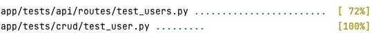
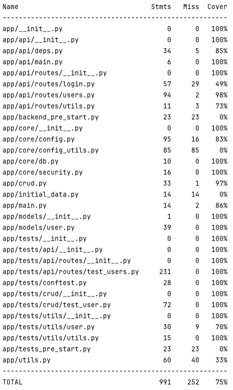

# Sessió 4
En aquesta sessió ens centrarem en la realització proves automàtiques del codi del backend.

## Objectius
* Executar proves
* Obtenir cobertura de les proves
* Implementar proves del codi

## Exercicis al laboratori

Durant aquesta sessió utilitzarem la llibreria **pytest** per implementar i executar les proves del backend.


### Exercici 1: Executa les proves unitàries

Podeu executar les proves que teniu ja definides en el projecte amb la comanda:

```bash
poetry run pytest app/tests
```
des del directori ```backend```. Haurieu de veure una sortida similar a la següent:



Cada punt després del nom d'un fitxer amb proves unitàries correspon a una prova passada correctament. En cas d'error,
apareix una **E** en comptes del punt.


### Exercici 2: Càlcul de la cobertura

La cobertura és la part del codi que s'executa durant les proves unitàries, i per tant, el percentatge de codi que
realment s'està provant. Per obtenir la cobertura de les nostres proves, caldrà instal·lar una llibreria addicional:

```bash
poetry add pytest-cov
poetry install
``` 

Un cop afegida la nova llibreria, podem executar les proves unitàries de nou per veure la informació de cobertura:

```bash
poetry run pytest --cov=app app/tests
```
des del directori ```backend```. Haurieu de veure una sortida similar a la següent:



Fixeu-vos que per cada fitxer tenim 3 columnes. La primera ens indica el nombre de línies de codi que conté el fitxer, 
la segona el nombre de línies de codi executades durant les proves unitàries, i finalment, el percentatge que representa
del total de línies.

### Exercici 3: Proves automatitzades

Revisa el fitxer ```.github/workflows/test.yml```. Aquest fitxer conté una acció automàtica de GitHub, que s'executa
cada vegada que es fa un **push a la branca principal**, o un **pull request**. Localitzes on s'estan executant les
proves? 

Obre el fitxer ```Readme.md``` del repositori, i fixa't que a la part superior tens una línia de l'estil:
```
[](https://github.com/xbaro/template_fastapi_vue_fl0/actions/workflows/test.yml)
```

Aquesta línia mostra l'estat de l'última vegada que s'han executat les accions automàtiques.

Substitueix les URLs per a que apuntin al teu repositori, canviant ```xbaro/template_fastapo_vue_fl0``` per 
```SoftwareDistribuitUB-2024/practica2-XYY```, on **XYY** és el codi del vostre grup de pràctiques. 

### Exercici 4: Generació de la documentació

Revisa el fitxer ```.github/workflows/docs.yml```. Aquest fitxer conté una acció automàtica de GitHub, que s'executa
cada cop que es fa **un push a la branca principal**. En aquest cas es genera la documentació associada al repositori,
que hauria d'estar dins el directori ```docs```. Si s'ha executat correctament, hauries de poder veure la documentació
a la URL:

https://softwaredistribuitub-2024.github.io/practica2-XYY/

on **XYY** és el codi del teu grup. Afegeix aquest enllaç al teu **Readme** per tal que sigui fàcil de localitzar.

**Nota:** En cas que no vegis aquesta pàgina, demana al teu professor que activi l'opció ```Pages``` del repositori del
vostre grup.

## Tasques fora del laboratori

### Tasca 1: Provar restriccions API

Per cada endpoint protegit de l'API, afegeix com a mínim una prova per cada tipus d'usuari:

* Un usuari sense autenticació
* Un usuari no administrador
* En cas de que hi hagi un cojunt d'usuaris que poden fer alguna acció (administradors, organitzadors, ...) una prova
amb un usuari que no estigui dins de la llista d'autoritzats i una prova amb un que si que ho estigui.
