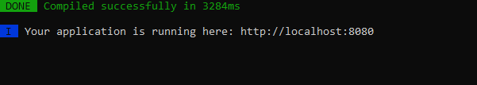
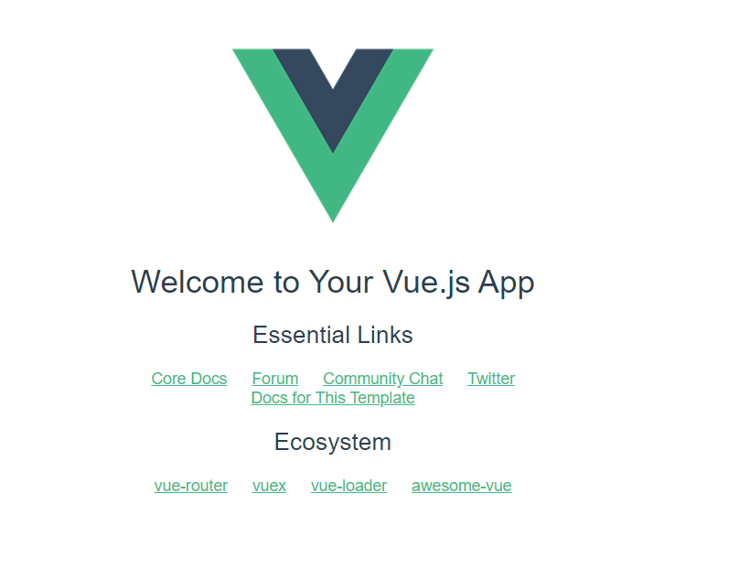

Introducció a Vue
=========

Vue és un framework progressiu per construir interfícies d'usuari, és a dir,
al costat del client. Tot i que Vue és més senzill que React o Angular, és
extremadament potent i es pot utilitzar per crear aplicacions avançades i
ofereix la creació de projectes de manera estructurada. Consisteix en un conjunt de
biblioteques opcionals i biblioteques de tercers, i compta amb una
comunitat en creixement. A més, Vue s'està convertint en molt popular i té un futur brillant.

Instal·lació de Vue
-----
Els següents passos s'han desenvolupat a la versió  5.0.4 de vue/cli, node.js versió 14.16.1 i npm versió v6.14.12.
Després d’instal·lar Vue, comprovem la versió del node:

	node --version

Si encara no teniu el node instal·lat o teniu una versió antiga, aneu a
<https://nodejs.org/en/download/> i instal·leu el paquet. Per verificar la instal·lació, feu servir les línies d’ordres següents:

	node --version
    npm --version
    
En cas que estigueu a Linux, haureu d'instal·lar Node Version Manager (NVM).
Us permetrà triar una versió de node específica. Per instal·lar-lo, podeu seguir aquesta guia:
<https://phoenixnap.com/kb/install-latest-node-js-and-nmp-on-ubuntu>. 

Hi ha alguns mètodes d'instal·lació per instal·lar Vue, en aquest cas l'instal·larem a través de Vue CLI.

 	 npm install -g @vue/cli
     npm install -g @vue/cli-init
    
Per obtenir més assistència, consulteu la següent guia d'instal·lació:
<https://cli.vuejs.org/guide/installation.html>. 
Després de la instal·lació, comproveu amb la línia d'ordres:

    vue --version

Crear i configurar un entorn de projecte
----
Primer de tot, aneu a la carpeta desitjada on voleu guardar el projecte. Després d'això, executeu a la línia d'ordres

    vue init webpack <name-project>

per exemple: 
	
	vue init webpack frontend
Seleccioneu la configuració tal com es mostra a
imatge següent:


Podeu interactuar amb les fletxes, les tecles d'entrada i l'espai.
Un cop creat el projecte, parem atenció als fitxers principals. La carpeta `/ src` té la següent estructura:


- **App.vue**: s'encarrega de representar els components

- **assets**: on deseu tots els recursos, com ara imatges

- **components**: tots els components dels projectes. Tots els components tenen la seva pròpia plantilla html i codi JavaScript

- **main.js**: inicialitza i configura l'aplicació Vue

- **index.js**: enruta els components del vostre projecte

Hello world in Vue
-----------
Per executar la nostra primera aplicació Vue:

    cd <name-project>
    npm run dev
   
En cas que feu servir el WebStorm de JetBrains, obriu el projecte anomenat frontend i creu una configuració  amb el boto de Run. Feu que sigui del tipus npm i l'script dev.

Després d'executar aquestes línies d'ordres, aneu a <http://localhost:8080/> al navegador.





Crear un component
------

Hem vist com executar un projecte. Ara veurem com crear el nostre propi component. Canvieu la plantilla html del fitxer `App.vue` com:

```html
<template>
    <router-view/>
</template>
```

A més, creeu un component nou anomenat `Matches.vue` a la carpeta de components. En aquest fitxer, copieu i enganxeu el codi següent:

```html
<template>
  <div id="app">
    <h1> {{ message }} </h1>
  </div>
</template>

<script>

export default {
  data () {
    return {
      message: 'My first component'
    }
  }
}

</script>
```

Com podeu veure aquí, tenim dos blocs anomenats "template" i "script". Com hem esmentat anteriorment, el primer bloc correspon a la visualització en html i el segon pertany al codi JavaScript. A "return" podem declarar les variables que utilitzarem al codi. També podeu interactuar incloent-hi les referències de codi a la plantilla html.
Paral·lelament, aneu a `index.js` per encaminar el nou component:

```js
import Vue from 'vue'
import Router from 'vue-router'
import Matches from '@/components/Matches'

Vue.use(Router)

export default new Router({
  mode: 'history',
  base: process.env.BASE_URL,
  routes: [
    {
      path: '/',
      name: 'Matches',
      component: Matches
    }
  ]
})

```
Comprovem el nostre nou component <http://localhost:8080/>


Bootstrap
---------

Bootstrap (<https://www.w3schools.com/whatis/whatis_bootstrap.asp>) és el framework CSS més popular per al desenvolupament de llocs web responsius i per a mòbils. Conté plantilles de disseny basades en CSS i JavaScript per a tipografia, formularis, botons, navegació i altres components de la interfície.


Per instal·lar-lo al nostre projecte, executeu la comanda següent en la línia d'ordres (dins el directori ```frontend```):

	npm install --save bootstrap-vue bootstrap
	

Després de la instal·lació, configureu el fitxer `main.js` important el Bootstrap:

```js
import Vue from 'vue'
import { BootstrapVue, IconsPlugin } from 'bootstrap-vue'
import App from './App.vue'
import router from './router'

// Importar els fitxers CSS de Bootstrap i BootstrapVue (l'ordre és important)
import 'bootstrap/dist/css/bootstrap.css'
import 'bootstrap-vue/dist/bootstrap-vue.css'

Vue.config.productionTip = false

// Fem que el Boostrap estigui disponible a tot el projecte
Vue.use(BootstrapVue)
// Opcionalment també podem instal·lar les icones
Vue.use(IconsPlugin)

/* eslint-disable no-new */
new Vue({
  el: '#app',
  router,
  components: { App },
  template: '<App/>'
})
```

Ara podem consumir les plantilles Bootstrap predefinides.

Mètodes
-----

A part de les variables, també podem definir mètodes i utilitzar-los en un bloc d'html. Definim una variable anomenada `tickets_bought` i un mètode
per incrementar aquest valor mitjançant un botó de Bootstrap a `Matches.vue`.

```html
<template>
  <div id="app">
    <h1> {{ message }} </h1>
    <button class="btn btn-success btn-lg" @click="buyTicket"> Buy ticket </button>
    <h4> Total tickets bought: {{ tickets_bought }} </h4>
  </div>
</template>

<script>

export default {
  data () {
    return {
      message: 'My first component',
      tickets_bought: 0
    }
  },
  methods: {
    buyTicket () {
      this.tickets_bought += 1
    }
  }
}

</script>
```

Com podeu veure, també podeu cridar a mètodes en un bloc html mitjançant `@click = "buyTickets"`, com en aquest cas.
